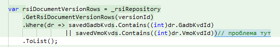
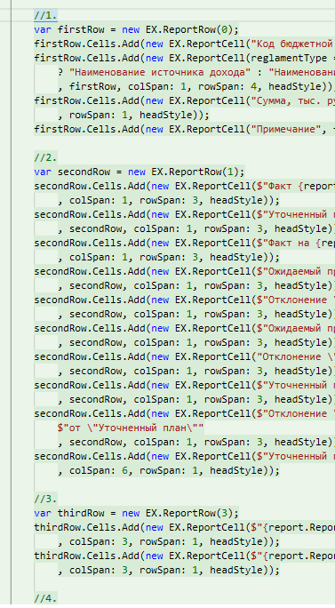
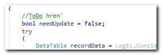

# Примеры шедевров исскуства комментирования кода

Все примеры из личного опыта, взяты из кода тех проектов, на которых я работал.

* Два чудных комментария (второй в пятой строке), несущих просто гигантскую информативную ценность 😆
```csharp
//?????
_viewData.Years = gp.GovProgramOtherTableYears
    .Where(q => q.TableName == GovProgramOtherTableYears.Indicators.Key)
    .Select(x => x.Year)
    .Union(_viewData.Years) //!
    .Distinct()
    .OrderBy(x => x)
    .ToList();
```

* Конечно, читатель кода знает, что время уже наступило. Он же экстрасенс 😆
```html
@*Вернуть когда наступит время!
<div class="filter__item">
    <div class="caption caption_filter">Наименование ОИВ</div>
    <div class="control control_large control_select">
        <select @Html.AsugfAutoComplete()>
            <option value="" selected>имя 1</option>
            <option value="">имя 2</option>
            <option value="">имя 3</option>
        </select>
    </div>
</div>*@
```

* Ещё пример коммента, написанного для читателей-экстрасенсов. Ведь им сразу понятно, в чём проблема



* Вот ещё целая пачка контекстно-зависимых комментов
```csharp
// Времянка
// Переписать
// Требуется переделка на уровне БД
```

* А здесь, как говорится, no comments 😆



* One more


----

_Дедушка Волшебник, 2021-03-14_ .. _2021-06-30_